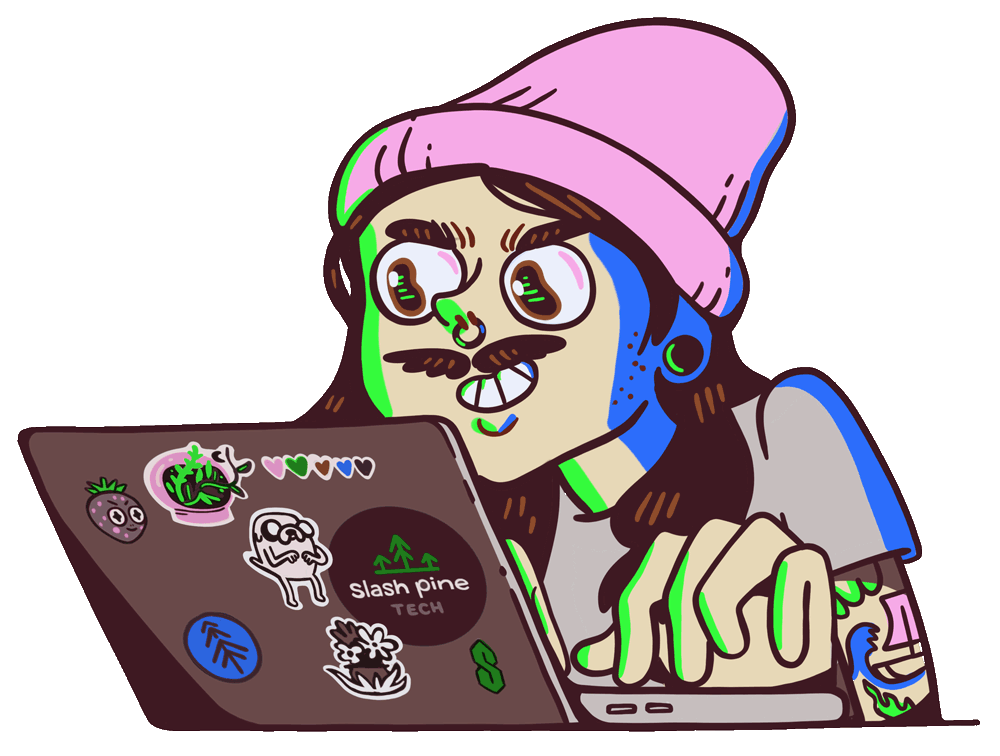

<!-- HEADER -->

  <h1>Hi 👋, I'm Amir Hossein</h1>
  <h3>A passionate Full Stack Developer from Iran</h3>

<!-- MAIN INTRO WITH GIF -->

  <table>
    <tr>
      <td>
        

          🌱 Currently learning <b>Full Stack Development & Networking</b> 
          👨‍💻 All my projects: <a href="https://github.com/amir13h">github.com/amir13h</a> 
          💬 Ask me about <b>Full Stack Development</b> 
          📫 Contact me: <b>t.me/amir_hossein83s</b>
        

      </td>
      <td>
        
      </td>
    </tr>
  </table>

 

<!-- PROFILE VIEWS -->

  

---

# 🔗 Connect With Me

  
  
  

---

# 🛠️ Languages & Tools

  
  
  
  
  
  
  
  
  
  
  
  
  
  
  

---

# ⚡ GitHub Stats

---

# 🐍 Contribution Snake

  

